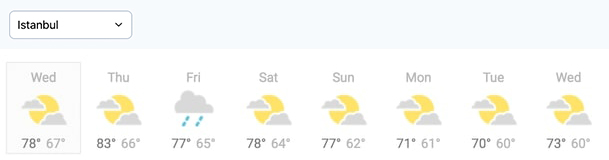
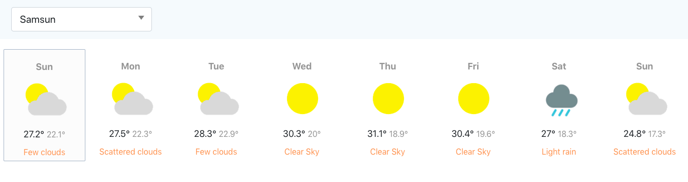

# Ödev 3
Sizden genel olarak bir hava durumu uygulaması geliştirmeniz bekleniyor. Türkiye'nin tüm illerinin bir haftalık hava raporunu görüntüleyebilmeliyiz.

Ekran aşadağı görseldeki gibi olacaktır.

# Result

## Gereksinimler
- Uygulama, Context API kullanılarak geliştirilmelidir.
- Hava raporunda görüntülenen veriler tamamen gerçeği yansıtmalıdır. Hava durum bilgilerine erişmek için OpenWeather API kullanılabilir. Veya dilediğiniz farklı bir API'ı da kullanabilirsiniz.
- Hava raporu, içinde bulunduğumuz günden başlayarak önümüzdeki bir haftalık süreci yansıtacaktır. Yukarıdaki görseli referans alabilirsiniz.
- Sayfa ilk açıldığında varsayılan olarak dilediğiniz herhangi şehrin hava durumunu gösterebilirsiniz. Bu noktada yapmak isteyenler için kullanıcıdan konum erişim izni istenerek bulunduğu şehrin bilgileri varsayılan olarak gösterilebilir.
- Yine yukarıdaki görselde görüleceği üzere, içinde bulunduğumuz gün, bir background ve border ile belirginleştirilmelidir.
- Günlerin listelendiği kartlarda; gün adı, hava durumu görseli(güneşli, yağmurlu, karlı, parçalı bulutlu), en yüksek ve en düşük sıcaklık gösterilmelidir.
- Bir dropdown aracılığı ile farklı bir şehrin hava raporuna ulaşılabilmelidir.

***
## Available Scripts

In the project directory, you can run:

### `yarn start`

Runs the app in the development mode.\
Open [http://localhost:3000](http://localhost:3000) to view it in the browser.

The page will reload if you make edits.\
You will also see any lint errors in the console.

### `yarn build`

Builds the app for production to the `build` folder.\
It correctly bundles React in production mode and optimizes the build for the best performance.

The build is minified and the filenames include the hashes.\
Your app is ready to be deployed!

See the section about [deployment](https://facebook.github.io/create-react-app/docs/deployment) for more information.
